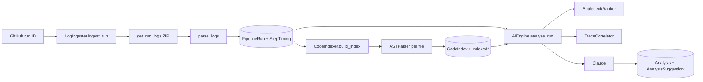
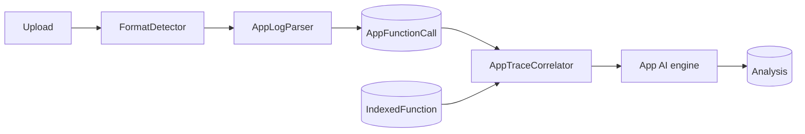
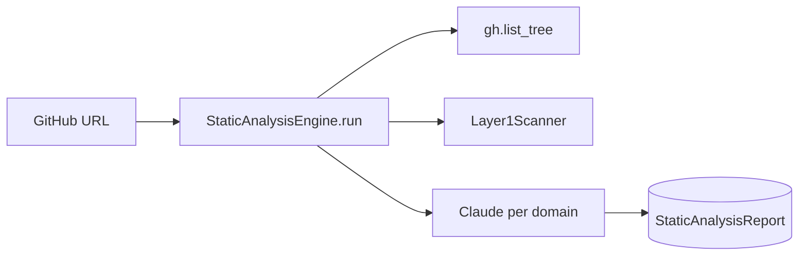

# Backend Engineering — DynamicAnalyser

This document describes how the backend fits together: persistence, AST indexing, CI/CD ingestion, ranking, correlation, LLM analysis, static analysis, and application-log pipelines. Read the **database tables** first—every service reads and writes through them.

---

## 1. The database layer (`models/database.py`)

All durable state lives in **SQLAlchemy ORM** tables. Services never bypass these models.

### CI/CD

| Table | Role |
|--------|------|
| **TrackedRepository** | Which GitHub repo (`owner/repo`) you monitor. |
| **PipelineRun** | One GitHub Actions workflow execution. |
| **StepTiming** | One step inside that run: name, `duration_ms`, `log_excerpt`. |
| **CodeIndex** | Metadata for one parse of a repo at a commit SHA. |
| **IndexedFunction** | Every function discovered in source. |
| **IndexedLogCall** | Every `logger.info("…")` / `print("…")` string tied to a function. |
| **Analysis** | LLM analysis output for a run. |
| **AnalysisSuggestion** | Individual fix suggestions from the LLM. |
| **AnalysisFeedback** | Developer accept/reject verdicts on suggestions. |

### Application logs

| Table | Role |
|--------|------|
| **AppLogSession** | One uploaded log file / session. |
| **AppFunctionCall** | One parsed function timing row from that log. |
| **LogFormatSchema** | Cached AI-inferred or user-supplied format regex. |
| **PatternConfidence** | Tracks anti-pattern acceptance/rejection over time. |

### Static analysis

| Table | Role |
|--------|------|
| **StaticAnalysisReport** | One GitHub repo scan: summary markdown + domain findings JSON. |

---

## 2. AST parsing (`ast_parser.py`) — core engine

Most downstream features depend on a single idea: **walk source with tree-sitter**, extract **functions**, **call sites**, and **log strings**, then materialize graphs and lookup maps.

### What is tree-sitter?

**tree-sitter** builds a **Concrete Syntax Tree (CST)** from source. Python’s `ast` module only handles Python; tree-sitter uses **per-language grammars** (Python, JS, TS, Java, Go, C, …) behind one API.

### Step 1 — Parser for the language

```python
mod = __import__("tree_sitter_python")
language = tree_sitter.Language(mod.language())
parser = tree_sitter.Parser(language)
```

Each grammar ships as its own package. Parsers are **cached per extension** so you do not recreate them on every file.

### Step 2 — Parse to a CST

```python
tree = parser.parse(source_code.encode("utf-8"))
# tree.root_node is the root of the syntax tree
```

Node names (`function_definition`, `call_expression`, …) depend on the grammar.

### Step 3 — Walk the CST and collect functions

```text
_walk(node, class_name=None):
  • function_definition      (Python)
  • function_declaration     (JS / TS / Go)
  • method_declaration       (Java)
```

For each function node:

- Resolve **name** from an `identifier` child.
- Record **`line_number`** / **`end_line_number`** from `node.start_point.row + 1` (and end).
- Build **qualified name** (e.g. `ClassName.method` inside a class).
- Recursively collect **callee names** from the body → `FunctionInfo.calls`.

That is how you know `fetchUsers()` lives at `UserService.java:89`.

### Step 4 — Extract log calls

Per language, **pattern lists** describe logging idioms, for example:

- **Python:** `("logger", "info")`, `("logger", "warning")`, `(None, "print")`, …
- **JavaScript:** `("console", "log")`, `("console", "error")`, `("logger", "info")`, …

The walker visits **`call_expression`** nodes; on a match, it takes the **first string argument** as the log text and records **which function** contained the call.

Resulting conceptually as:

```text
IndexedLogCall(
  log_string="Running migrations",
  file="db.py",
  line=47,
  function="run_migrations",
)
```

### Step 5 — Call graph and reverse call graph

| Structure | Meaning |
|-----------|---------|
| **call_graph** | `func_name → [callees]` — what this function invokes. |
| **reverse_call_graph** | `func_name → [callers]` — who invokes this function. |

The reverse graph powers **call-chain** explanations in analysis output.

### Step 6 — Log line map

```text
log_line_map = { log_string_text → SourceLocation(file, line, function) }
```

At **correlation** time, a cleaned log line can map straight back to the exact source location that emitted it.

### `CodeIndexer.build_index()`

Orchestration:

1. Obtain file tree (**GitHub API** or **local directory walk**).
2. Filter by supported extensions and **file size** limits.
3. Cap total files at **`AST_INDEX_MAX_FILES`** (default 5000).
4. Per file: load content → **`ASTParser.parse_file()`** → accumulate functions and log calls.
5. Build **call graph**, **reverse graph**, and **log line map**.
6. Return **`CodeIndexData`** in memory and **persist** to the DB (`CodeIndex`, `IndexedFunction`, `IndexedLogCall`).

---

## 3. CI/CD pipeline — log ingestion (`log_parser.py` + `ingester.py`)

### `log_parser.py` — GitHub log shape

Each line often looks like:

```text
2024-03-19T10:32:01.4567890Z Running database migrations
```

**`TIMESTAMP_RE`** strips the prefix, leaving the **message**.

GitHub also uses section markers:

```text
##[group]Run npm install
...
##[endgroup]
```

and errors:

```text
##[error]Test failed: assertion error
```

The downloaded archive is a **ZIP** of `.txt` files such as:

```text
build/2_Run npm install.txt
test/5_Run pytest.txt
```

The numeric prefix is the **step index**. **`_extract_step_name_from_header()`** derives human-readable step names.

**`_finalize_step()`** computes `duration_ms` from first/last timestamps and builds a **`log_excerpt`** (e.g. first ~2000 chars of meaningful content).

### `ingester.py` — `LogIngester.ingest_run()`

1. **Dedup**: respect unique index on `repository_id` + `github_run_id`.
2. **GitHub API**: run metadata (status, `head_sha`, workflow name).
3. **`github_client.get_run_logs()`** → ZIP bytes.
4. **`parse_logs()`** → `list[ParsedStep]`.
5. Create **`PipelineRun`** + **`StepTiming`** rows in **one transaction**.

---

## 4. Bottleneck ranking (`bottleneck_ranker.py`)

Across the last **N** runs, each step gets descriptive statistics:

| Stat | Definition |
|------|------------|
| **mean_ms** | Arithmetic mean of durations. |
| **p50_ms** | Median. |
| **p95_ms** | 95th percentile. |
| **std_dev_ms** | Population standard deviation. |
| **trend_slope** | Linear regression slope over run index. |
| **latest_ms** | Duration in the most recent run. |
| **pct_of_total** | `mean_ms / sum(all step means)` |

### Trend (linear regression)

```text
x_mean = (n - 1) / 2
y_mean = mean(durations)
slope = Σ[(i - x_mean)(d - y_mean)] / Σ[(i - x_mean)²]
```

**Positive slope** → step tends to get slower over time (early warning).

### Anomaly

```text
anomaly = clamp( (latest_ms - mean_ms) / std_dev_ms , 0 , 5 )
```

Captures a step that is usually fine but **spiked** on the latest run.

### Composite score

```text
score = 0.5 × pct_of_total
      + 0.3 × (anomaly / 5.0)
      + 0.2 × trend_flag
```

- **pct_of_total** — largest absolute time consumer.  
- **anomaly** — sudden regression vs history.  
- **trend_flag** — structural drift.

---

## 5. Trace correlation (`trace_correlator.py`)

Bridges **CI step log text** and **indexed source**: given a step’s **`log_excerpt`**, find the file and line that likely produced it.

### Three-tier cascade

| Tier | Idea | Confidence |
|------|------|------------|
| **1 — Exact** | Strip timestamps and `##[group]` noise; lookup in **`log_line_map`**. | **1.0** |
| **2 — Fuzzy** | `difflib.get_close_matches` over all indexed log strings; refine with `SequenceMatcher.ratio()`. | **~0.5–0.9** |
| **3 — Grep** | Derive a search term from step name (e.g. drop `"run "` prefix); match **function names**. | **~0.3–0.5** |

After a hit, walk **`reverse_call_graph`** up to ~**5** levels to produce the **call chain** (e.g. `main → build_pipeline → run_migrations`).

---

## 6. AI engine (`ai_engine.py`)

Once bottlenecks are ranked and traces correlated, the engine assembles **AnalysisContext**:

```text
AnalysisContext
├── repo, commit SHA, total duration
├── feedback_history (past accepted / rejected suggestions)
└── bottlenecks[]
    ├── step name, duration, p95, trend
    ├── source_function, source_file, source_line  (from TraceCorrelator)
    ├── call_chain (string)
    └── source code of the function (fetched from GitHub API)
```

The **user prompt** is structured markdown: run summary, top bottlenecks with code, feedback history, and a **JSON schema** the model must satisfy.

**LLM call** (conceptually):

```text
client.messages.create(
  model="claude-sonnet-4-6",
  system=SYSTEM_PROMPT,
  messages=[...],
)
```

**Response** is validated with Pydantic, e.g.:

```text
LLMAnalysisResult
  root_cause: str
  primary_bottleneck: str
  anti_patterns: list[str]
  suggestions: list[LLMSuggestion]
  estimated_total_saving_ms: int
```

If JSON parsing fails, a **correction** prompt and **one retry** are used.

---

## 7. Static analysis (`static_analysis_engine.py` + `layer1_scanner.py`)

Two layers: **deterministic Python AST** for DB smells, **domain-chunked LLM** for breadth.

### Layer 1 — `layer1_scanner.py` (no LLM)

Uses Python’s **`ast`** module (not tree-sitter) for **Python-only**, structural rules, for example:

- **N+1** queries: ORM `.filter()` / `.all()` inside a loop over another queryset.  
- **Missing `select_related`**: FK attribute accessed on a loop variable without `select_related` on the outer query.  
- **Missing `prefetch_related`**: reverse relation accessed in a loop without prefetch.  
- **`.count()` in a loop** → prefer `annotate(Count(...))`.  
- **Python-side filtering** over `QuerySet` instead of DB `.filter()`.  
- **SQL injection** patterns: f-string SQL, concatenation, `.format()`.  
- **`commit()` in a loop** → batch commits.  
- **Multi-table writes** without **`transaction.atomic()`**.

**`_FuncAnalyzer`** tracks scope (`_loop_stack`, `_atomic_stack`, `_assignments`) so context is preserved (e.g. knowing a queryset came from `.all()` a few lines above).

### Layer 2 — `static_analysis_engine.py`

1. **`gh.list_tree()`** at a commit SHA.  
2. **`classify_domain()`** per path → **security**, **database**, **backend**, **frontend**, **infrastructure**.  
3. **Score** files: Layer-1 hits, security signals, down-rank tests.  
4. Per domain, **`_pick_top_files()`** → manifest + excerpts + AST signals.  
5. **Claude** per domain → structured issues (`severity`, `title`, `file_path`, `before_code`, `after_code`, `explanation`).  
6. Final **executive-summary** LLM pass over consolidated findings.  
7. Persist **`StaticAnalysisReport`**.

---

## 8. Application log analysis

### Format detection (`app_log_parser.py`)

Score the first ~100 lines against several formats; winner must clear a threshold (e.g. **> 0.3**):

| Family | Notes |
|--------|--------|
| **json** | `json.loads` per line. |
| **spring** | `YYYY-MM-DD HH:MM:SS.mmm LEVEL [thread]`. |
| **syslog** | Classic syslog prefix patterns. |
| **logfmt** | Multiple `key=value` pairs. |
| **tshark** | `Frame N:`, `elapsed=`, `dissect_*`, … |
| **rails** | `Completed 200 OK` / `Processing by`. |
| **enter_exit** | Paired ENTER/EXIT. |
| **heuristic** | Generic timing patterns (e.g. `42ms`). |

### Parsing

Each format implements **`BaseParser`** and returns **`UniversalLogRecord`** rows: `func_name`, `duration_ms`, `timestamp`, `log_excerpt`, `call_number`, etc.

### Ingestion (`app_ingester.py`)

```text
read file → readlines() → detect format → parse → AppFunctionCall rows → session totals
```

### App trace correlation (`app_trace_correlator.py`)

Unlike CI correlation (log **text** → `log_line_map`), app logs often carry **real function names**. Matching:

1. Lookup **`IndexedFunction`** by name.  
2. Fallback: **normalized** name (strip `()`, leading `_`, package prefixes).  
3. Optional **fuzzy** ratio match.

Results update **`AppFunctionCall`** with source location and call chain context.

### App AI (`app_ai_engine.py` conceptually)

Top slow paths + context → **Claude** → **`Analysis`** / **`AnalysisSuggestion`** rows for the session.

---

## 9. End-to-end data flow

### CI/CD path



### App log path



### Static analysis path



---

## 10. What ties everything together

> **One `CodeIndex` at a given repo + commit SHA** is shared by **CI/CD trace correlation** (log text → `log_line_map`), **app-log correlation** (function name → `IndexedFunction`), and **static analysis** (excerpts + AST signals per domain). That shared index is what makes DynamicAnalyser a **platform** instead of three disconnected tools.

---

*For slide-oriented summaries, see `docs/analysis-overview-slides.md`.*
